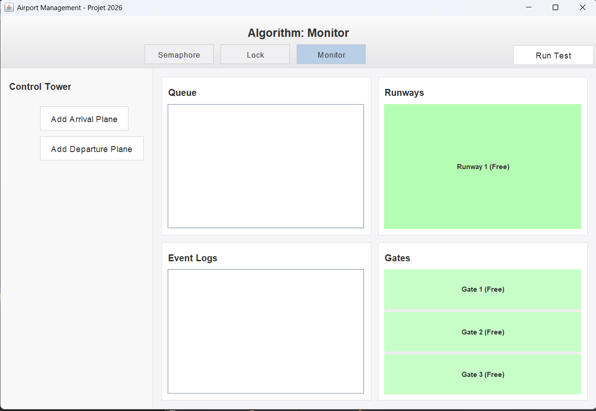

# 🛫 Airport Resource Allocation Simulator

## Project Overview

This application is a desktop simulator designed to model the complex operations and resource allocation within an international airport, specifically focusing on the synchronization of concurrent processes.

It serves as a practical demonstration of concurrency concepts by managing limited resources such as Runways and Gates for incoming and outgoing aircraft. The structure is designed to allow easy comparison between three core Java synchronization mechanisms.

### Key Focus

* **Concurrency:** Visually demonstrates how synchronization primitives prevent deadlocks and ensure orderly resource access in a multi-threaded environment.
* **Resource Management:** Tracks the status and usage of critical airport infrastructure (Runways and Gates).
* **Modern UI:** The interface is currently undergoing a redesign to adopt a clean, minimalist style (inspired by macOS/Apple design principles) for improved clarity and user experience.

---

## ✨ Features

| Component | Function | Synchronization Logic |
| :--- | :--- | :--- |
| **Control Tower** | Allows users to manually inject new aircraft processes (`Arrival Plane` or `Departure Plane`) into the system queue. | N/A |
| **Queue** | Displays all pending aircraft processes currently waiting for a resource. | Managed by synchronization logic to ensure FIFO or priority-based access. |
| **Runways** | Manages the primary resource for landing and takeoff. **(Limited Resource)** | Clearly indicates **Free** (Green) or **Occupied** status. |
| **Gates** | Manages the gates required for aircraft to dock. **(Limited Resource)** | Clearly indicates **Free** (Green) or **Occupied** status. |
| **Event Logs** | Provides a detailed, chronological record of all system events, including resource allocation, state changes, and process completion. | Logs output generated by the active synchronization algorithm. |

### Synchronization Algorithms

The project is structured to easily switch between three concurrency control methods to observe their behavior:

1.  **Semaphore** (Implemented in `SemaphoreVersion/`)
2.  **Lock** (Implemented in `LockVersion/`)
3.  **Monitor** (Implemented in `MonitorVersion/`)

---

## 💻 Technical Details

| Detail | Value |
| :--- | :--- |
| **Programming Language** | **Java** |
| **Framework/Toolkit** | **Swing / JavaFX** (Standard Java GUI Libraries) |
| **Development Environment** | **Eclipse IDE** |
| **Core Logic** | Demonstrating concurrent programming using synchronization primitives. |

---

## 🖼️ User Interface Preview

### Current Interface 

=

---

## 🚀 Getting Started (Run with Eclipse)

Since this is a standard Eclipse Java project, the easiest way to run it is by importing it into the IDE.

### Prerequisites

You will need the following software installed on your machine:

* **Java Development Kit (JDK) 17 or newer** (Recommended)
* **Eclipse IDE for Java Developers**

### Installation and Run

1.  **Clone the Repository**
    ```bash
    git clone [https://github.com/mohamedkrouf/AirportManagement_KroufMohamed.git](https://github.com/mohamedkrouf/AirportManagement_KroufMohamed.git)
    ```

2.  **Import into Eclipse**
    * Open **Eclipse IDE**.
    * Go to **File** $\rightarrow$ **Import...**
    * Select **General** $\rightarrow$ **Existing Projects into Workspace**.
    * Click **Next**.
    * Click **Browse...** next to "Select root directory" and choose the cloned repository folder (`AirportManagement_KroufMohamed`).
    * Click **Finish**.

3.  **Run the Application**
    * Locate the main application class (likely inside `GUI/` or one of the `*Version/` folders).
    * Right-click the main class file and select **Run As** $\rightarrow$ **Java Application**.

---

## 🤝 Contribution

This project is currently for personal learning and demonstration purposes, specifically to practice thread synchronization in Java and modern UI implementation. Feedback and suggestions for improving the logic or design are always welcome!
